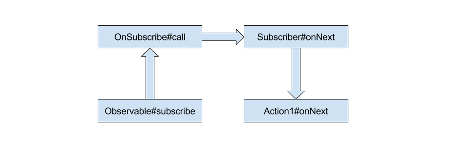

# RxJava 源码解读笔记（一）

## 1 被观察者如何发射数据

创建 Observable 通常有 3 种方式：just、from、create。

### 1.1 just

创建一个 Observable 最简单的方式，使用 `just`：
```
Observable
        .just("Hello world")
        .subscribe(word -> {
            System.out.println("Got word " + word);
        });
```

相关源码：

```
// Observable.java
public static <T> Observable<T> just(final T value) {
    return ScalarSynchronousObservable.create(value);        // 1
}

// ScalarSynchronousObservable.java
public static <T> ScalarSynchronousObservable<T> create(T t) {
    return new ScalarSynchronousObservable<T>(t);            // 2
}

protected ScalarSynchronousObservable(final T t) {
    super(RxJavaHooks.onCreate(new JustOnSubscribe<T>(t)));  // 3
    this.t = t;
}
```

这里先不管RxJavaHooks，可以简单理解成 RxJava 做的一层包装，并不影响代码的实际逻辑。看 RxJavaHooks.onCreate() 源码：

```
// RxJavaHooks.java
public static <T> Observable.OnSubscribe<T> onCreate(Observable.OnSubscribe<T> onSubscribe) {
    Func1<Observable.OnSubscribe, Observable.OnSubscribe> f = onObservableCreate;
    if (f != null) {
        return f.call(onSubscribe);
    }
    return onSubscribe;
}
```

返回的还是同一个 `OnSubscribe`，因此从代码逻辑看 `super(RxJavaHooks.onCreate(new JustOnSubscribe<T>(t)))` 和 `super(new JustOnSubscribe<T>(t))` 其实是等价的。这里相当于调用了 `Observable` 的构造方法：

```
// Observable.java
protected Observable(OnSubscribe<T> f) {
    this.onSubscribe = f;
}
```

需要明确一点，Observable 构造方法传入的是一个 OnSubscribe 接口，这是一个回调接口。只有当 Observable#subscribe 时，OnSubscribe#call 方法才会被调用。这一点从 subscribe 部分再作详细说明。

### 1.2 from

当需要发送的数据项不止一个，而是一个集合，可以使用 `from` 创建 Observable：

```
Observable
        .from(Arrays.asList("Hello", "World"))
        .subscribe(word -> {
            System.out.println("Got word " + word);
        });
```

相关源码：

```
// Observable.java
public static <T> Observable<T> from(Iterable<? extends T> iterable) {
    return create(new OnSubscribeFromIterable<T>(iterable));          // 1
}

// OnSubscribeFromIterable.java
public OnSubscribeFromIterable(Iterable<? extends T> iterable) {      // 2
    if (iterable == null) {
        throw new NullPointerException("iterable must not be null");
    }
    this.is = iterable;
}
```

`OnSubscribeFromIterable` 是 `OnSubscribe` 的一个实现类。

### 1.3 create

创建 Observable 最基本的方法，create：

```
// Observable.java
public static <T> Observable<T> create(OnSubscribe<T> f) {
    return new Observable<T>(RxJavaHooks.onCreate(f));   // 1
}

protected Observable(OnSubscribe<T> f) {
    this.onSubscribe = f;                                // 2
}
```

## 2 订阅被观察者

 前面提到过，创建 Observable 时传入的 `OnSubscribe` 接口是一个回调接口。那么，这个什么时候会调用这个回调接口呢？答案是 Observable#subscribe，即 Observable 被订阅的时候。
 
 Observable 提供了多种订阅方式供开发者选择，但是无论使用哪种方式，最终都会走到 `subscribe(Subscriber<? super T> subscriber, Observable<T> observable)`。这里，以 `subscribe(final Action1<? super T> onNext)` 作为例子：
 
 ```
 // Observable.java
 public final Subscription subscribe(final Action1<? super T> onNext) {
    if (onNext == null) {
        throw new IllegalArgumentException("onNext can not be null");
    }
    Action1<Throwable> onError = InternalObservableUtils.ERROR_NOT_IMPLEMENTED;   // 1
    Action0 onCompleted = Actions.empty();                                        // 2
    return subscribe(new ActionSubscriber<T>(onNext, onError, onCompleted));      // 3
}

public final Subscription subscribe(Subscriber<? super T> subscriber) {
    return Observable.subscribe(subscriber, this);                                 // 4
}

// ActionSubscriber.java
public ActionSubscriber(Action1<? super T> onNext, Action1<Throwable> onError, Action0 onCompleted) {
    this.onNext = onNext;
    this.onError = onError;
    this.onCompleted = onCompleted;
}

@Override
public void onNext(T t) {
    onNext.call(t);          // 5
}
@Override
public void onError(Throwable e) {
    onError.call(e);         // 6
}
@Override
public void onCompleted() {
    onCompleted.call();      // 7
}
 ```
 
 首先要明确，Observable#subscribe 方法传入的是一个 `Subscriber`，`Subscriber` 是个什么东西呢？
 
 ```
 public abstract class Subscriber<T> implements Observer<T>, Subscription {
    // 代码省略
 }
 ```
 
 其实，Observable#subscribe 方法传入的就是一个观察者。通过 Observable#subscribe 方法，被观察者和观察者建立起联系。
 
 Observable#subscribe 核心代码：
 
 ```
 static <T> Subscription subscribe(Subscriber<? super T> subscriber, Observable<T> observable) {
    // 省略参数校验代码
    
    // new Subscriber so onStart it
    subscriber.onStart();                                    // 1
    /*
     * See https://github.com/ReactiveX/RxJava/issues/216 for discussion on "Guideline 6.4: Protect calls
     * to user code from within an Observer"
     */
    // if not already wrapped
    if (!(subscriber instanceof SafeSubscriber)) {
        // assign to `observer` so we return the protected version
        subscriber = new SafeSubscriber<T>(subscriber);       // 2
    }
    // The code below is exactly the same an unsafeSubscribe but not used because it would
    // add a significant depth to already huge call stacks.
    try {
        // allow the hook to intercept and/or decorate
        RxJavaHooks.onObservableStart(observable, observable.onSubscribe).call(subscriber);      // 3
        return RxJavaHooks.onObservableReturn(subscriber);
    } catch (Throwable e) {
        // 省略异常捕获代码
    }
}
 ```

1. 调用 Subscriber#onStart 方法。这里需要注意，onStart 方法所在线程就是当前线程。也就是说，Schedules 并不会影响 onStart 所运行的线程；
2. `SafeSubscriber` 是保证一个 `Subscriber` 遵循 [The Observable Contract](http://reactivex.io/documentation/contract.html)；
3. 跳过 RxJavaHooks 逻辑，相当于 observable.onSubscribe#call(subscriber)。

回想一下 Observable 是如何被创建的：

```
 Observable
         .create(new Observable.OnSubscribe<String>() {
             @Override
             public void call(Subscriber<? super String> subscriber) {
                 subscriber.onNext("Hello world");        // 1
                 subscriber.onCompleted();
             }
         });
```

因此，当 observable.onSubscribe#call(subscriber) 被执行时，相当于就开始执行位置 1 的代码逻辑，数据就开始从被观察者发送到观察者了。



## 3 Backpressure

考虑这么一种情况，Observable 数据发的太快，Subscriber 处理不过来，应该怎么办？这就是 Rxjava 引入 Backpressure 的原因。

> 在 RxJava 1.x 中，数据都是从 Observable push 到 Subscriber 的，但要是 Observable 发得太快，Subscriber 处理不过来，该怎么办？一种办法是，把数据保存起来，但这显然可能导致内存耗尽；另一种办法是，多余的数据来了之后就丢掉，至于丢掉和保留的策略可以按需制定；还有一种办法就是让 Subscriber 向 Observable 主动请求数据，Subscriber 不请求，Observable 就不发出数据。它俩相互协调，避免出现过多的数据，而协调的桥梁，就是 Producer。

### 3.1 再看 just 操作符

通过前面分析可以知道，使用 just 创建 Observable，传入的是一个 JustOnSubscribe：

```
// Observable.java
protected ScalarSynchronousObservable(final T t) {
    super(RxJavaHooks.onCreate(new JustOnSubscribe<T>(t)));   // 1
    this.t = t;
}

// ScalarSynchronousObservable.java
/** The OnSubscribe callback for the Observable constructor. */
static final class JustOnSubscribe<T> implements OnSubscribe<T> {
    final T value;
    JustOnSubscribe(T value) {
        this.value = value;
    }
    @Override
    public void call(Subscriber<? super T> s) {
        s.setProducer(createProducer(s, value));              // 2
    }
}

static <T> Producer createProducer(Subscriber<? super T> s, T v) {
    if (STRONG_MODE) {
        return new SingleProducer<T>(s, v);
    }
    return new WeakSingleProducer<T>(s, v);                   // 3
}
```

1. 创建 JustOnSubscribe 实例；
2. 为 JustOnSubscribe 设置一个 Producer；
3. 创建一个 Producer。

`setProducer` 源码：

```
// Subscriber.java
public void setProducer(Producer p) {
    long toRequest;
    boolean passToSubscriber = false;
    synchronized (this) {
        toRequest = requested;
        producer = p;
        if (subscriber != null) {
            // middle operator ... we pass through unless a request has been made
            if (toRequest == NOT_SET) {
                // we pass through to the next producer as nothing has been requested
                passToSubscriber = true;
            }
        }
    }
    // do after releasing lock
    if (passToSubscriber) {
        subscriber.setProducer(producer);
    } else {
        // we execute the request with whatever has been requested (or Long.MAX_VALUE)
        if (toRequest == NOT_SET) {
            producer.request(Long.MAX_VALUE);  // 1
        } else {
            producer.request(toRequest);       // 2
        }
    }
}

// WeakSingleProducer.java
@Override
public void request(long n) {
    if (once) {
        return;
    }
    if (n < 0L) {
        throw new IllegalStateException("n >= required but it was " + n);
    }
    if (n == 0L) {
        return;
    }
    once = true;
    Subscriber<? super T> a = actual;
    if (a.isUnsubscribed()) {
        return;
    }
    T v = value;
    try {
        a.onNext(v);                          // 3
    } catch (Throwable e) {
        Exceptions.throwOrReport(e, a, v);
        return;
    }
    if (a.isUnsubscribed()) {
        return;
    }
    a.onCompleted();                          // 4
}
```

最终会调用 Producer#request 方法。因此，这种情况下，Observable 并不会主动发送数据，而是要等 Subscriber 通过 Producer 主动来取。


## 4 参考

- [拆轮子系列：拆 RxJava](http://blog.piasy.com/2016/09/15/Understand-RxJava/)