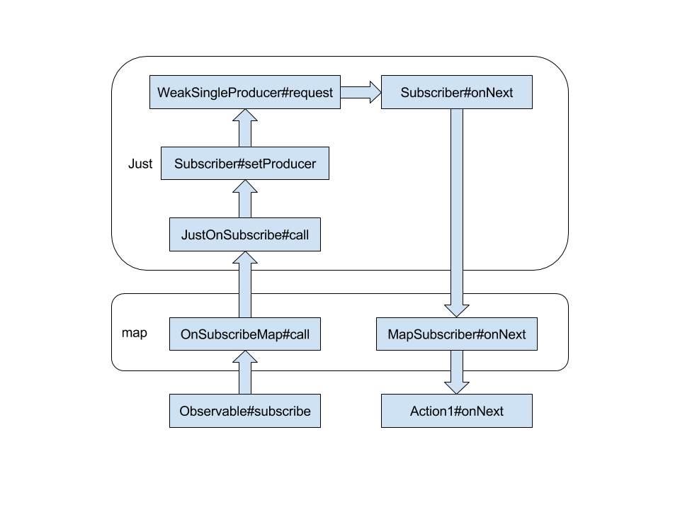

# RxJava 源码解读笔记（二）

## 操作符

从最常用的 map 操作符，剖析 RxJava 数据转换的原理：

```
Observable
        .just(1)
        .map(String::valueOf)
        .subscribe(value -> {
            System.out.println("got " + value + " , type is " + value.getClass().getCanonicalName());
        });
```

这里，只是简单地将一个整型数据转换成字符串数据。相关源码：

```
// Observable.java
public final <R> Observable<R> map(Func1<? super T, ? extends R> func) {
    return create(new OnSubscribeMap<T, R>(this, func));          // 1
}

// OnSubscribeMap.java
public OnSubscribeMap(Observable<T> source, Func1<? super T, ? extends R> transformer) {
    this.source = source;
    this.transformer = transformer;
}

@Override
public void call(final Subscriber<? super R> o) {
    MapSubscriber<T, R> parent = new MapSubscriber<T, R>(o, transformer);   // 2
    o.add(parent);                                                          // 3
    source.unsafeSubscribe(parent);                                         // 4
}
```

1. `map` 操作符创建了一个**新的 Observable**，传入的是 `OnSubscribeMap`；
2. 利用传入的 Subscriber 以及我们进行转换的 Func1 构造一个 MapSubscriber；
3. 将新建的 Subscriber 添加到传进来的 Subscriber，方便一起取消反订阅；
4. Observable#unsafeSubscribe 相较于前面的 Observable#subscribe 方法，少了一层 SafeSubscriber 的包装。为什么不要包装？因为我们会在最后调用 Observable#subscribe 时进行包装，只需要包装一次即可。

到这里，上游 Observable 就会被执行。那么数据的转换在哪里呢？答案是 `MapSubscriber`：

```
// OnSubscribeMap$MapSubscriber
@Override
public void onNext(T t) {
    R result;
    try {
        result = mapper.call(t);              // 1
    } catch (Throwable ex) {
        Exceptions.throwIfFatal(ex);
        unsubscribe();
        onError(OnErrorThrowable.addValueAsLastCause(ex, t));
        return;
    }
    actual.onNext(result);                    // 2
}
```

当上游往下通知数据时，首先进入到 OnSubscribeMap$MapSubscriber#onNext()。这里，根据传入的 Func1 进行数据转换，转换结束后将数据通知给真正的 Subscriber。

在 RxJava 中，上游和下游的概念可以描述为：

> 这里要解释一下“上游”和“下游”的概念：按照我们写的代码顺序，just 在 map 的上面，Action1 在 map 的下面，数据从 just 传递到 map 再传递到 Action1，所以对于 map 来说，just 就是上游，Action1 就是下游。数据是从上游（Observable）一路传递到下游（Subscriber）的，请求则相反，从下游传递到上游。

